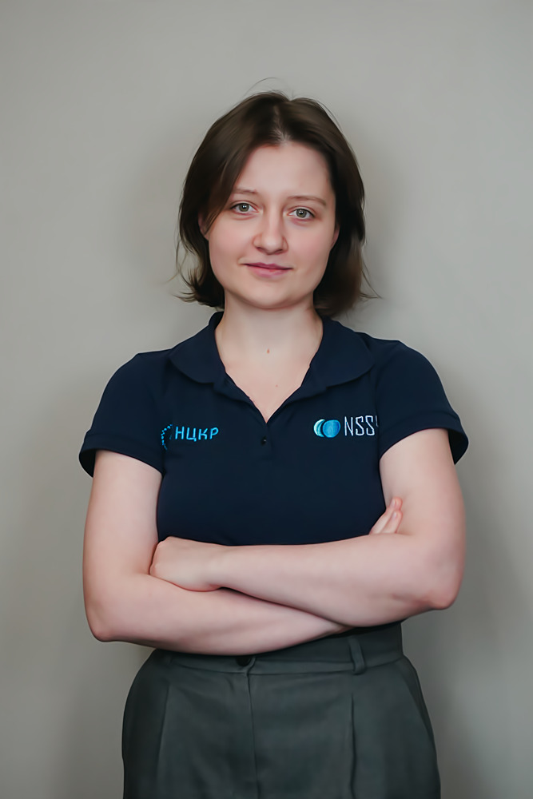

# NSS Team

   

## Here are some of our projects:

<a href="https://github.com/nccr-itmo/FEDOT">
#### [FEDOT](https://github.com/nccr-itmo/FEDOT) is a framework for automated machine learning. It can build composite pipelines for the different real-world processes in an automated way using an evolutionary approach.
 
Nikitin N. O. et al. [Hybrid and automated machine learning approaches for oil fields development: The case study of Volve field, North Sea](https://www.sciencedirect.com/science/article/pii/S0098300422000267) //Computers & Geosciences. – 2022. – Т. 161. – С. 105061.
 
Sarafanov M. et al. [Short-Term River Flood Forecasting Using Composite Models and Automated Machine Learning: The Case Study of Lena River](https://www.mdpi.com/2073-4441/13/24/3482) // Water. – 2021.

Nikitin N. O. et al. [Automated Evolutionary Approach for the Design of Composite Machine Learning Pipelines](https://doi.org/10.1016/j.future.2021.08.022) // Future Generation Computer Systems. – 2021.
 
Sarafanov M., Nikitin N. O., Kalyuzhnaya A. V. [Automated data-driven approach for gap filling in the time series using evolutionary learning](https://link.springer.com/chapter/10.1007/978-3-030-87869-6_60) // Advances in Intelligent Systems and Computing book series, volume 1401 – 2021.

Nikitin N. O. et al. [Hybrid and Automated Machine Learning Approaches for Oil Fields Development: the Case Study of Volve Field, North Sea](https://arxiv.org/abs/2103.02598) //arXiv preprint arXiv:2103.02598. – 2021.

Polonskaia I. S. et al. [Multi-Objective Evolutionary Design of Composite Data-Driven Models](https://ieeexplore.ieee.org/document/9504773) // 2021 IEEE Congress on Evolutionary Computation (CEC) – 2021.

Kalyuzhnaya A. V. et al. [Towards Generative Design of Computationally Efficient Mathematical Models with Evolutionary Learning](https://www.mdpi.com/1099-4300/23/1/28) //Entropy. – 2021. – Т. 23. – №. 1. – С. 28.

Nikitin N.O., Polonskaia I.S., Vychuzhanin P., Barabanova I.V., Kalyuzhnaya  A.V. [Structural Evolutionary Learning for Composite Classification Models](https://www.sciencedirect.com/science/article/pii/S1877050920324224) //Procedia computer science. – 2020. – Т. 178. – C. 414-423.

Kalyuzhnaya A. V. et al. [Automatic evolutionary learning of composite models with knowledge enrichment](https://dl.acm.org/doi/pdf/10.1145/3377929.3398167?casa_token=vjmVJTzfcf8AAAAA:juxWF2cvTe4vwR9EDqkt7_UWwH3TuwKW4jo7rv-d5kBT6cV7qMhDTvz3nMOsShnLXWCFvC39k3Hd) //Proceedings of the 2020 Genetic and Evolutionary Computation Conference Companion. – 2020. – С. 43-44.

Nikitin N. O. et al. [Evolutionary ensemble approach for behavioral credit scoring](https://www.researchgate.net/publication/325714407_Evolutionary_Ensemble_Approach_for_Behavioral_Credit_Scoring?_sg=mdIOU8V3dznIXWbudhKw29tyU8xmkYlpDKr0wO8RlfLyaYhwZBMGQBQwBZVbfxakx73iZwVKLR0e46o3XgAPR2Wmdbg) //International Conference on Computational Science. – Springer, Cham, 2018. – С. 825-831.

The repository is available in [github](https://github.com/nccr-itmo/FEDOT). You can find documentation [here.](https://itmo-nss-team.github.io/FEDOT.Docs/)

### Bayesian Analytical and Modelling Toolkit
#### It is a data modeling and analysis tool based on Bayesian networks. It can be divided into two main parts - algorithms for constructing and training Bayesian networks on data and algorithms for applying Bayesian networks for filling gaps, generating synthetic data, and searching for anomalous values.

Andriushchenko P. et al. [Oil reservoir recovery factor assessment using Bayesian networks based on advanced approaches to analogues clustering](https://arxiv.org/abs/2204.00413) //arXiv preprint arXiv:2204.00413. – 2022.
 
Deeva I., Andriushchenko P.D., Kalyuzhnaya A.V., Boukhanovsky A.V. [Bayesian Networks-based personal data synthesis](https://dl.acm.org/doi/abs/10.1145/3411170.3411243?casa_token=L3ckOXS-ocoAAAAA%3AgFfEnScGXFvW-A9clmUaRHuJtf5gl9-GVPRziORtfx1U5_e9CCQWWT9en7EC8BTJjmfg83JVLyTUCw) // ACM International Conference Proceeding Series - 2020, pp. 6-11

Andriushchenko P.D.,Deeva I.Y., Kalyuzhnaya A.V., Bubnova А.V., Voskresensky А.G., Bukhanov N.V. [Analysis of parameters of oil and gas fields using Bayesian networks](https://elibrary.ru/item.asp?id=44382521) // Data Science in Oil and Gas 2020 - 2020. - С. 1-10

Deeva I. et al. [Oil and Gas Reservoirs Parameters Analysis Using Mixed Learning of 
Networks](https://arxiv.org/abs/2103.01804) //arXiv preprint arXiv:2103.01804. – 2021.

The repository is available in  [github](https://github.com/ITMO-NSS-team/Bayesian-Analytical-and-Modelling-Toolkit)

### EPDE framework
#### EPDE is a framework for differential equation discovery, that inspires researches to create new models in an understandable mathematical form.

Maslyaev M., Hvatov A., Kalyuzhnaya A. [Data-Driven Partial Differential Equations Discovery Approach for the Noised Multi-dimensional Data](https://dl.acm.org/doi/abs/10.1145/3377929.3398167) //International Conference on Computational Science. – Springer, Cham, 2020. – С. 86-100.

Merezhnikov M., Hvatov A. [Closed-form algebraic expressions discovery using combined evolutionary optimization and sparse regression approach](https://www.sciencedirect.com/science/article/pii/S1877050920324236) // Procedia Computer Science. – 2020. – Т. 178. – С. 424-433.

Maslyaev M., Hvatov A., Kalyuzhnaya A. [Discovery of the data-driven models of continuous metocean process in form of nonlinear ordinary differential equations](https://www.sciencedirect.com/science/article/pii/S1877050920323760) //Procedia Computer Science. – 2020. – Т. 178. – С. 18-26.

Hvatov A., Maslyaev M. [The data-driven physical-based equations discovery using evolutionary approach](https://arxiv.org/pdf/2004.01680.pdf) // Proceedings of the 2020 Genetic and Evolutionary Computation Conference Companion. - 2020. - C. 129–130.

Maslyaev M., Hvatov A., Kalyuzhnaya A. [Data-Driven Partial Derivative Equations Discovery with Evolutionary Approach](https://www.researchgate.net/publication/333664933_Data-Driven_Partial_Derivative_Equations_Discovery_with_Evolutionary_Approach) //International Conference on Computational Science. – Springer, Cham, 2019. – С. 635-641.

Maslyaev M., Hvatov A. [Discovery of the data-driven differential equation-based models of continuous metocean process](https://www.sciencedirect.com/science/article/pii/S1877050919311329) //Procedia Computer Science. – 2019. – Т. 156. – С. 367-376.

For more information, see [EPDE](https://github.com/ITMO-NSS-team/EPDE)/
 

#### GEFEST
 
Georgii V. Grigorev, Nikolay O. Nikitin et al. [Single Red Blood Cell Hydrodynamic Traps Via the Generative Design](https://www.mdpi.com/2072-666X/13/3/367) // Micromachines, 2022
 
Nikitin N. O. et al. [The multi-objective optimisation of breakwaters using evolutionary approach](https://www.taylorfrancis.com/chapters/edit/10.1201/9781003216599-82/multi-objective-optimisation-breakwaters-using-evolutionary-approach-nikolay-nikitin-iana-polonskaia-anna-kalyuzhnaya-alexander-boukhanovsky) //Developments in Maritime Technology and Engineering. – CRC Press, 2021. 
 
Nikitin N. O. et al. [Generative design of microfluidic channel geometry using evolutionary approach](https://dl.acm.org/doi/abs/10.1145/3449726.3462740)//Proceedings of the Genetic and Evolutionary Computation Conference Companion. – 2021. 
 
Starodubcev N. O., Nikitin N. O., Kalyuzhnaya A. V. [Surrogate-Assisted Evolutionary Generative Design Of Breakwaters Using Deep Convolutional Networks](https://arxiv.org/abs/2204.03400) //arXiv preprint arXiv:2204.03400. – 2022.

 
### Metocean Simulation
#### Creation and calibration of metocean simulation models for data restoration, anomalies or patterns detection

Sarafanov M. et al. [A Machine Learning Approach for Remote Sensing Data Gap-Filling with Open-Source Implementation: An Example Regarding Land Surface Temperature, Surface Albedo and NDVI](https://www.mdpi.com/2072-4292/12/23/3865) //Remote Sensing. – 2020. – Т. 12. – №. 23. – С. 3865.

Araya-Lopez J. L., Nikitin N. O., Kaluzhnaya A. V. [Case-adaptive ensemble technique for metocean data restoration](https://www.researchgate.net/publication/327901758_Case-adaptive_ensemble_technique_for_met-ocean_data_restoration) //Procedia Computer Science. – 2018. – Т. 136. – С. 311-320.

Deeva I., Nikitin N. O., Kaluyzhnaya A. V. [Pattern recognition in Non-Stationary Environmental Time Series Using Sparse Regression](https://www.researchgate.net/publication/336081847_Pattern_Recognition_in_Non-Stationary_Environmental_Time_Series_Using_Sparse_Regression)
//Procedia Computer Science. – 2019. – Т. 156. – С. 357-366.

Hvatov A. et al. [Adaptation of NEMO-LIM3 model for multi-grid high-resolutional Arctic simulation](https://www.researchgate.net/publication/335092481_Adaptation_of_NEMO-LIM3_model_for_multigrid_high_resolution_Arctic_simulation)
//Ocean Modelling. – 2019. – Т. 141. – С. 101427. [View on GitHub](https://github.com/ITMO-NSS-team/nemo-multigrid-adaptation)

Nikitin N. O. et al. [The multi-objective optimisation of breakwaters using evolutionary approach](https://arxiv.org/abs/2004.03010) //arXiv preprint arXiv:2004.03010. – 2020.

Nikitin N. O. et al. [Deadline-driven approach for multi-fidelity surrogate-assisted environmental model calibration: SWAN wind wave model case study](https://dl.acm.org/doi/abs/10.1145/3319619.3326876) //Proceedings of the Genetic and Evolutionary Computation Conference Companion. – 2019. – С. 1583-1591. [View on GitHub](https://github.com/ITMO-NSS-team/FEDOT.Algs)

Vychuzhanin P., Hvatov A., Kalyuzhnaya A. V. [Anomalies Detection in Metocean Simulation Results using CNN](https://www.researchgate.net/publication/327900515_Anomalies_Detection_in_Metocean_Simulation_Results_Using_Convolutional_Neural_Networks) //Procedia Computer Science. – 2018. – Т. 136. – С. 321-330. [View on GitHub](https://github.com/ITMO-NSS-team/AnomaliesDetector)

Vychuzhanin P., Nikitin N. O., Kalyuzhnaya A. V. [Robust Ensemble-Based Evolutionary Calibration of the Numerical Wind Wave Model](https://www.researchgate.net/publication/333665595_Robust_Ensemble-Based_Evolutionary_Calibration_of_the_Numerical_Wind_Wave_Model)
 //International Conference on Computational Science. – Springer, Cham, 2019. – С. 614-627. [View on GitHub](https://github.com/ITMO-NSS-team/Deadline-driven-surrogate-optimisation)

### Social Media Study

#### Investigation of social media profiles and activities for personality prediction 

Deeva I. [Computational Personality Prediction Based on Digital Footprint of a Social Media User](https://www.researchgate.net/publication/335527567_Computational_Personality_Prediction_Based_on_Digital_Footprint_of_A_Social_Media_User) //Procedia Computer Science. – 2019. – Т. 156. – С. 185-193.

Kalyuzhnaya A. V. et al. [Precedent-Based Approach for the Identification of Deviant Behavior in Social Media](https://www.researchgate.net/publication/325715988_Precedent-Based_Approach_for_the_Identification_of_Deviant_Behavior_in_Social_Media) //International Conference on Computational Science. – Springer, Cham, 2018. – С. 846-852.

Uteuov A. [Topic model for online communities’ interests prediction](https://www.researchgate.net/publication/336081707_Topic_model_for_online_communities%27_interests_prediction)
 //Procedia Computer Science. – 2019. – Т. 156. – С. 204-213.
 
### Weather Forecasting

#### Forecasting of natural accidents and weather conditions 

Nikitin N. O. et al. [Statistics-based models of flood-causing cyclones for the Baltic Sea region](https://www.sciencedirect.com/science/article/pii/S1877050916326990) //Procedia Computer Science. – 2016. – Т. 101. – С. 272-281.

Noymanee J., Nikitin N. O., Kalyuzhnaya A. V. [Urban Pluvial Flood Forecasting using Open Data with Machine Learning in Pattani Basin](https://www.researchgate.net/publication/321459341_Urban_Pluvial_Flood_Forecasting_using_Open_Data_with_Machine_Learning_Techniques_in_Pattani_Basin) //Procedia computer science. – 2017. – Т. 119. – С. 288-297.

Uteuov A., Kalyuzhnaya A., Boukhanovsky A. [The cities weather forecasting by crowdsourced atmospheric data](https://www.researchgate.net/publication/336079909_The_cities_weather_forecasting_by_crowdsourced_atmospheric_data)
 //Procedia Computer Science. – 2019. – Т. 156. – С. 347-356.
 
# Some of us

| Member        | Contacts           | Main scientific projects  |
| ------------- |:-------------:| -------------:|
|     | Anna Kalyuzhnaya (anna.kalyuzhnaya@itmo.ru)| Head of NSS Laboratory and Master 's Program "Digital Geotechnologies." Probabilistic models of natural and social systems, generative methods AutoML |
|      | Nikolay Nikitin (nnikitin@itmo.ru)      |  AutoML and composite models, generative design of digital and physical objects, numerical optimization, environmental simulation |
|  |  Alexander Hvatov (alex_hvatov@itmo.ru)   |     Evolutionary algorithms for data-driven modeling, differential equations, acoustics, etc. |
|  |  Irina Deeva (ideeva@itmo.ru)      |    Bayesian networks, synthetic data generation, statistical analysis of multivariate data, social data modeling|
|  |  Mikhail Sarafanov (mik_sar@itmo.ru)      |    Time series forecasting, software development of an AutoML framework, remote sensing data processing|
|  |  Julia Borisova (jul.borisova@itmo.ru)      |    Time series processing and predictive modeling, hybridization and ensemble learning, geoinformatics tasks|
|  |  Ilya Revin (ierevin@itmo.ru)     |    Machine learning methods for seismic exploration and oil reservoir engeeniring, environmental dynamical system modeling, time series analysis|

And Mikhail Maslyaev, Anna Bubnova, Petr Andryuschenko, Anastasia Yashchenko.

## Towards Data Science articles

[How AutoML helps to create composite AI?](https://towardsdatascience.com/how-automl-helps-to-create-composite-ai-f09e05287563)

[AutoML for time series: definitely a good idea](https://towardsdatascience.com/automl-for-time-series-definitely-a-good-idea-c51d39b2b3f)

[AutoML for time series: advanced approaches with FEDOT framework](https://towardsdatascience.com/automl-for-time-series-advanced-approaches-with-fedot-framework-4f9d8ea3382c)

## Habr articles

[Как AutoML помогает создавать модели композитного ИИ — говорим о структурном обучении и фреймворке FEDOT](https://habr.com/ru/company/spbifmo/blog/558450/)

[Прогнозирование временных рядов с помощью AutoML](https://habr.com/ru/post/559796/)

[Как мы “повернули реки вспять” на Emergency DataHack 2021, объединив гидрологию и AutoML](https://habr.com/ru/post/577886/)
# Follow us via [GitHub](https://github.com/ITMO-NSS-team), [YouTube](https://www.youtube.com/channel/UC4K9QWaEUpT_p3R4FeDp5jA), [Telegram](https://t.me/NSS_group) and [ResearchGate](https://www.researchgate.net/lab/Natural-Systems-Simulation-Team-Anna-Kalyuzhnaya) 

