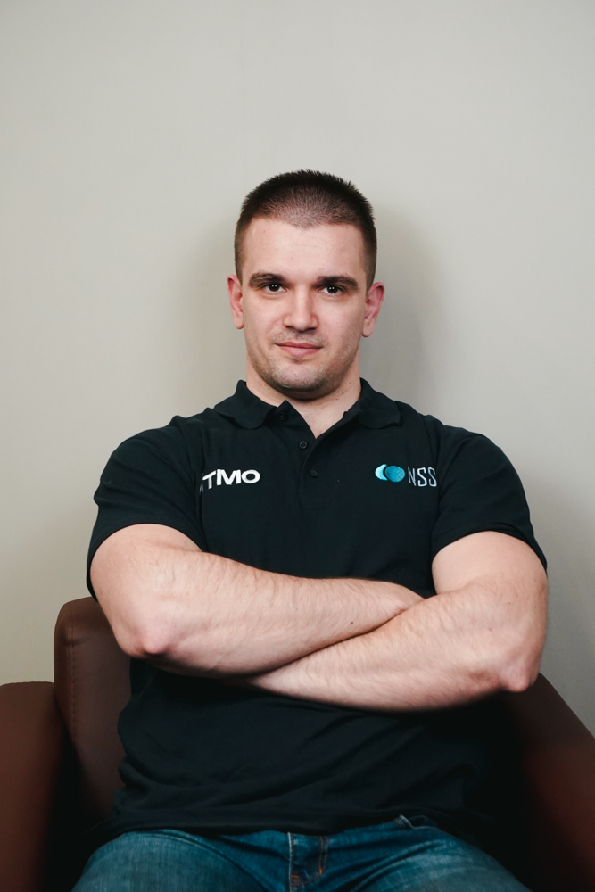

# NSS Lab

  

## Here are some of our projects:

### AutoML
#### [FEDOT](https://github.com/nccr-itmo/FEDOT), [FEDOT.Industrial](https://github.com/aimclub/Fedot.Industrial).

**Main papers**:

Nikitin N. O. et al. [Integration of evolutionary automated machine learning with structural sensitivity analysis for composite pipelines](https://www.sciencedirect.com/science/article/pii/S0950705124009973) //Knowledge-Based Systems. – 2024. – Т. 302. – С. 112363.

Revin I. et al. [Automated machine learning approach for time series classification pipelines using evolutionary optimisation](https://www.sciencedirect.com/science/article/abs/pii/S0950705123002332) //Knowledge-Based Systems. – 2023. – С. 110483.
 
Nikitin N. O. et al. [Hybrid and automated machine learning approaches for oil fields development: The case study of Volve field, North Sea](https://www.sciencedirect.com/science/article/pii/S0098300422000267) //Computers & Geosciences. – 2022. – Т. 161. – С. 105061.
 
Nikitin N. O. et al. [Automated Evolutionary Approach for the Design of Composite Machine Learning Pipelines](https://doi.org/10.1016/j.future.2021.08.022) // Future Generation Computer Systems. – 2021.

 ### AI4Science and LLM agents
  #### [ProtoLLM](https://github.com/aimclub/ProtoLLM), [OSA](https://github.com/ITMO-NSS-team/Open-Source-Advisor)

- Solovev G. V. et al. Towards LLM-Driven Multi-Agent Pipeline for Drug Discovery: Neurodegenerative Diseases Case Study //AAAI 2024 2nd AI4Research Workshop: Towards a Knowledge-grounded Scientific Research Lifecycle.
- Kalyuzhnaya A. et al. LLM Agents for Smart City Management: Enhancing Decision Support Through Multi-Agent AI Systems //Smart Cities (2624-6511). – 2025. – Т. 8. – №. 1.
- Gubina N. et al. [Hybrid Generative AI for De Novo Design of Co-Crystals with Enhanced Tabletability](https://openreview.net/forum?id=G4vFNmraxj) //The Thirty-eighth Annual Conference on Neural Information Processing Systems, 2024.

### Probabilistic modelling
#### [BAMT](https://github.com/aimclub/BAMT)

Kaminsky Y., Deeva I. Lsevobn: a structure learning algorithm for large bayesian networks //Proceedings of the Companion Conference on Genetic and Evolutionary Computation. – 2023. – С. 2366-2369.

Bubnova A., Deeva I., Kalyuzhnaya A.V. [MIxBN: library for learning Bayesian networks from mixed data](https://www.sciencedirect.com/science/article/pii/S1877050921020925) // Procedia Computer Science - 2021, Vol. 193, pp. 494-503
 

### Equation discovery
#### [EPDE](https://github.com/ITMO-NSS-team/EPDE), [TEDEouS](https://github.com/ITMO-NSS-team/torch_DE_solver)

Ivanchik E., Hvatov A. Knowledge-aware differential equation discovery with automated background knowledge extraction //Information Sciences. – 2025. – С. 122131.

Maslyaev M., Hvatov A., Kalyuzhnaya A. V. Partial differential equations discovery with EPDE framework: Application for real and synthetic data //Journal of Computational Science. – 2021. – Т. 53. – С. 101345.

Maslyaev M., Hvatov A., Kalyuzhnaya A. [Data-Driven Partial Derivative Equations Discovery with Evolutionary Approach](https://www.researchgate.net/publication/333664933_Data-Driven_Partial_Derivative_Equations_Discovery_with_Evolutionary_Approach) //International Conference on Computational Science. – Springer, Cham, 2019. – С. 635-641.

### Generative design
#### [GEFEST](https://github.com/ITMO-NSS-team/GEFEST) - toolbox for the generative design of physical objects and [GOLEM](https://github.com/aimclub/GOLEM) - optimizer for DAGs.

Pinchuk M. et al. Golem: Flexible evolutionary design of graph representations of physical and digital objects //Proceedings of the Genetic and Evolutionary Computation Conference Companion. – 2024. – С. 1668-1675.
  
Starodubcev N. O. et al. [Generative design of physical objects using modular framework](https://www.sciencedirect.com/science/article/abs/pii/S0952197622007059) //Engineering Applications of Artificial Intelligence. – 2023.
 
Georgii V. Grigorev, Nikolay O. Nikitin et al. [Single Red Blood Cell Hydrodynamic Traps Via the Generative Design](https://www.mdpi.com/2072-666X/13/3/367) // Micromachines, 2022
   
  
### Metocean Forecasting

#### Forecasting of sea ice and other environmental processes 
 
Borisova J., Nikitin N. O. Lightweight Neural Ensemble Approach for Arctic Sea Ice Forecasting //2024 IEEE Congress on Evolutionary Computation (CEC). – IEEE, 2024. – С. 1-8.
 
Sarafanov M. et al. [Short-Term River Flood Forecasting Using Composite Models and Automated Machine Learning: The Case Study of Lena River](https://www.mdpi.com/2073-4441/13/24/3482) // Water. – 2021.

Hvatov A. et al. [Adaptation of NEMO-LIM3 model for multi-grid high-resolutional Arctic simulation](https://www.researchgate.net/publication/335092481_Adaptation_of_NEMO-LIM3_model_for_multigrid_high_resolution_Arctic_simulation) //Ocean Modelling. – 2019. – Т. 141. – С. 101427.

<h2>Some of us</h2>
 

| Member        | Contacts           | Main scientific projects  |
| ------------- |:-------------:| -------------:|
|  |  Alexander Hvatov (alex_hvatov@itmo.ru)      | Head of NSS Laboratory.   Evolutionary algorithms for data-driven modeling, differential equations, acoustics, etc. |
|  |  Anna Kalyuzhnaya (anna.kalyuzhnaya@itmo.ru) | Head of Master 's Program "AI for Industry." LLM agents, probabilistic models, syntetic data |
|  |  Nikolay Nikitin (nnikitin@itmo.ru)      |  AI4Science, AutoML, generative design, open-source |
|  |  Irina Deeva (ideeva@itmo.ru)      |    Bayesian networks, synthetic data generation, statistical analysis of multivariate data|
|  |  Julia Borisova (jul.borisova@itmo.ru)      |    Time series processing and predictive modeling, hybridization and ensemble learning, geoinformatics tasks|
|  |  Ilya Revin (ierevin@itmo.ru)     |    Machine learning for industrial applications, time series analysis|

And Bashkova Ksenia, Ivanchik Elizaveta, Kuznetsov Andrey, Lobanov Ivan, Markov Ilya, Mikhail Maslyaev, Yaroslav Aksenkin, Yuri Kaminsky, Nikita Balabanov, Elizaveta Lucenko, Roman Netrogolov, Andrey Getmanov, Potemkin Vadim, Gleb Soloviev, Sokolov Ilya, Gabdrakhmanov Rustam, Dmitry Gusarov, Ilya Galyukshev, Elena Ilinskaya, Strelkov Leon, Monnar Ivan, Malysheva Elizaveta, Krylov Viktor, Hilchuk Maria, Zhidkovskaya Alina, Georgiy Lopatenko, Fathiev Kamil, Lapin Alexey, Dubrovsky Ivan, Yezhov Danil, Iov Illarion, Guryev Ivan, Alyona Kropacheva, Vladimir Latypov, Stanislav Chumakov, Gilemkhanov Dmitry, Zainulabidova Zaira, Popov Zakhar, Nargiza Amirkhanova.

 
## Towards Data Science articles
 
[Clean AutoML for “Dirty” Data](https://towardsdatascience.com/clean-automl-for-dirty-data-how-and-why-to-automate-preprocessing-of-tables-in-machine-learning-d79ac87780d3)

[How AutoML helps to create composite AI?](https://towardsdatascience.com/how-automl-helps-to-create-composite-ai-f09e05287563)

[AutoML for time series: definitely a good idea](https://towardsdatascience.com/automl-for-time-series-definitely-a-good-idea-c51d39b2b3f)

[AutoML for time series: advanced approaches with FEDOT framework](https://towardsdatascience.com/automl-for-time-series-advanced-approaches-with-fedot-framework-4f9d8ea3382c)
 
[What to Do If a Time Series Is Growing (But Not in Length)](https://towardsdatascience.com/what-to-do-if-a-time-series-is-growing-but-not-in-length-421fc84c6893)

## Habr articles

[Яндекс, Сбер и Т-Банк: ИТМО назвал лидеров Open Source в России](https://habr.com/ru/companies/spbifmo/news/843698/)

[Как мы развиваем библиотеку для анализа данных с помощью байесовских сетей](https://habr.com/ru/companies/spbifmo/articles/838598/)

[Прогнозируем движение льда в Арктике с помощью фреймворка автоматически собираемых сверток](https://habr.com/ru/companies/selectel/articles/818649/)

[Open Source в российском ИИ: исследование ландшафта](https://habr.com/ru/companies/spbifmo/articles/805455/)
 
[Про настройку гиперпараметров ансамблей моделей машинного обучения](https://habr.com/ru/post/672486/)
 
[Чистый AutoML для “грязных” данных: как и зачем автоматизировать предобработку таблиц в машинном обучении](https://habr.com/ru/company/ods/blog/657525/)

[Как AutoML помогает создавать модели композитного ИИ — говорим о структурном обучении и фреймворке FEDOT](https://habr.com/ru/company/spbifmo/blog/558450/)

[Прогнозирование временных рядов с помощью AutoML](https://habr.com/ru/post/559796/)

[Как мы “повернули реки вспять” на Emergency DataHack 2021, объединив гидрологию и AutoML](https://habr.com/ru/post/577886/)

 [Что делать, если твой временной ряд растёт вширь](https://habr.com/ru/post/696336/)

## Open-Source initiative

ITMO.Opensource [chat](https://t.me/itmo_opensource) and [repository](https://github.com/ITMO-NSS-team/open-source-ops), [Scientific Opensource](https://t.me/scientific_opensource) channel.

[Исследование «Использование ML/Data-опенсорса в России»](https://opensource.itmo.ru)
 
# Follow us via [GitHub](https://github.com/ITMO-NSS-team), [YouTube](https://www.youtube.com/channel/UC4K9QWaEUpT_p3R4FeDp5jA), [Telegram](https://t.me/NSS_group), [colab.ws](https://colab.ws/labs/254)

